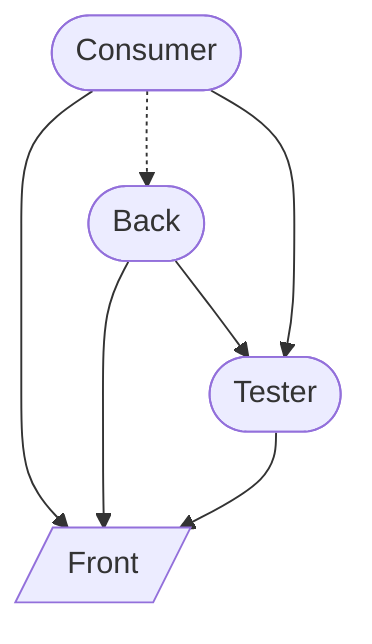

# Trial 1

- [`front`](./front): The interfaces making up the entry point like an API. This should have very little code bodies.
- [`back`](./back): The implementation of the front. This should not need to be directly accessed. This should contain unit-tests using the tester `package`.
- [`tester`](./tester): A set of testing tools for internal and external testing tools. This can not depend on the `back` package so that it can be used in testing `back` without creating a circular dependency.
- [`consumer`](./consumer): A package specifically to test/demonstrate how this pattern would be used.

## Remarks

I like this pattern except for `back.Prepare()`. I wish that could be `init()` so that it is automatically run.
However if it is `init()` then nothing imports `back` and so the `init()` is never run.

Not sure how to make the `tester` easy to setup with a real instance gotten from `front`.
I don't really want the consumer have to pass in the factory to use for the real.
